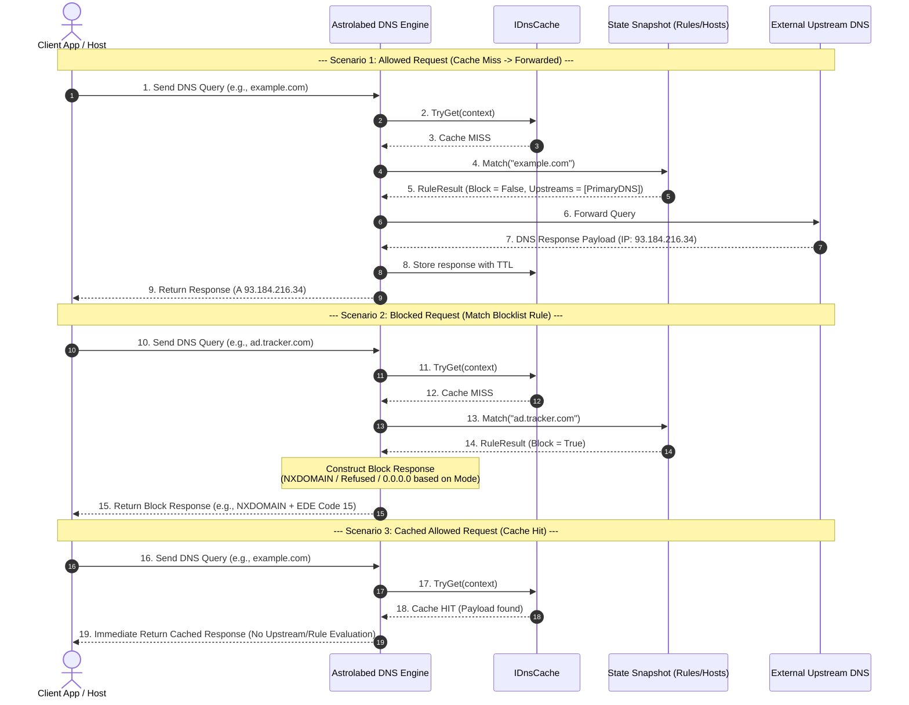
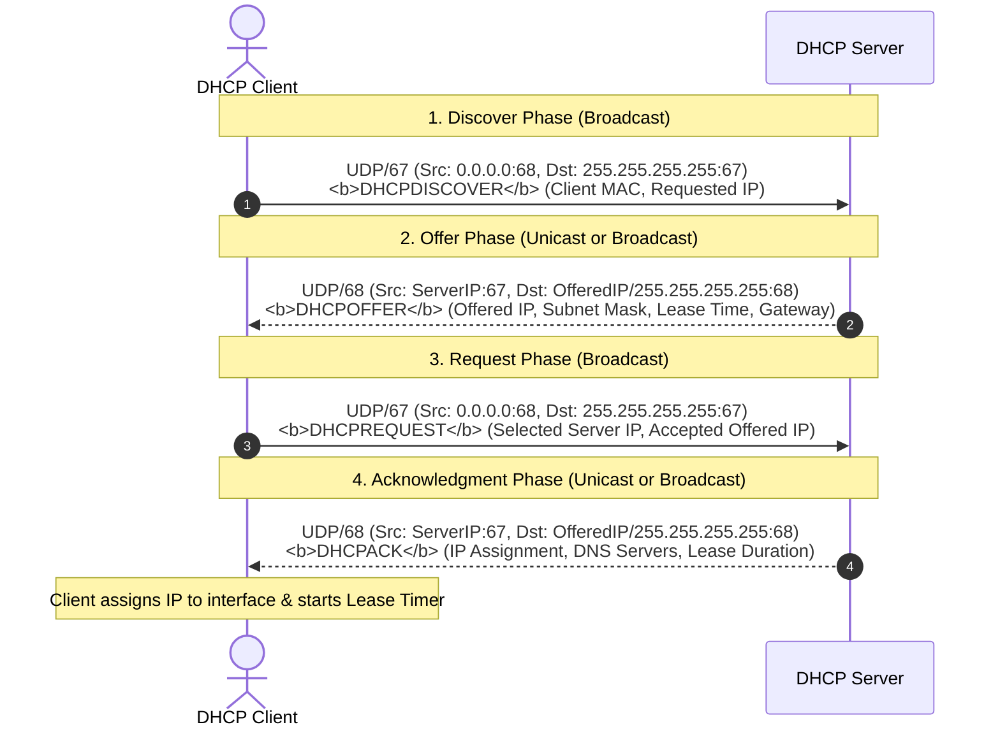
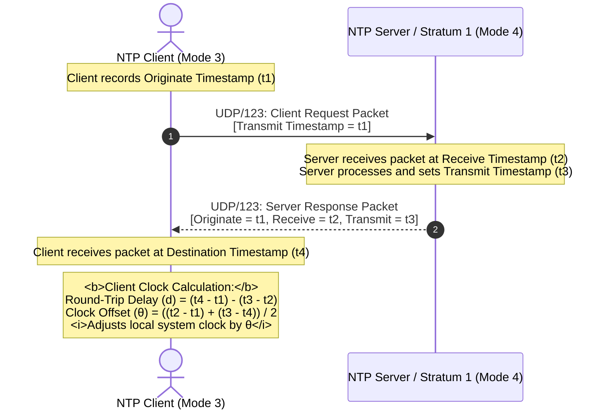

# Architecture & Flow Diagrams

Below are simple mermaid diagrams illustrating the high-level architecture and request flows for DNS, DHCP and NTP.

## High-level component diagram

```mermaid
graph TD
    classDef boundaryStyle fill:#0f172a,stroke:#38bdf8,stroke-width:2px,color:#fff
    classDef coreStyle fill:#1e1b4b,stroke:#818cf8,stroke-width:2px,color:#fff
    classDef engineStyle fill:#111827,stroke:#34d399,stroke-width:2px,color:#fff
    classDef dataStyle fill:#1f2937,stroke:#fbbf24,stroke-width:2px,color:#fff
    classDef extStyle fill:#1e293b,stroke:#94a3b8,stroke-width:2px,color:#fff

    subgraph Transport ["Network Inbound Interface"]
        UdpListener["UDP Server Listener"] :::boundaryStyle
        TcpListener["TCP Server Listener"] :::boundaryStyle
        DohListener["DoH / HTTPS Endpoint"] :::boundaryStyle
    end

    subgraph Pipeline ["DnsPipeline (Request / Response Pipeline)"]
        ContextBuilder["Context Builder & Decoder"] :::engineStyle
        RespBuilder["Response Builder & Encoder"] :::engineStyle
    end

    subgraph CoreEngine ["RuleEngine (Core Resolution Hub)"]
        MatchHub["Rule Matcher Hub"] :::coreStyle
        ExecHub["Query Executor"] :::coreStyle
        
        subgraph Snapshot ["State Snapshot (Lock-Free Read)"]
            HostsTable["Hosts Dictionary"] :::dataStyle
            RulesAutomata["Rule Compiler & Automata"] :::dataStyle
            UpstreamChain["Upstream Chain Builder"] :::dataStyle
        end
    end

    subgraph SystemServices ["Cross-Cutting Services"]
        Cache["IDnsCache (DNS Cache)"] :::engineStyle
        Metrics["IDnsMetrics (Telemetry & Events)"] :::engineStyle
        Options["IOptionsMonitor (Configuration)"] :::engineStyle
    end

    subgraph DynamicLoaders ["Background State Loaders"]
        HostsLoader["Hosts File Sources"] :::dataStyle
        BlocklistLoader["Blocklist Sources"] :::dataStyle
    end

    subgraph UpstreamResolvers ["External DNS Upstreams"]
        PrimaryDns["Primary Upstream (e.g. DoH / DoT)"] :::extStyle
        FallbackDns["Fallback Upstream (e.g. UDP)"] :::extStyle
    end

    %% Flow Connections
    Transport --> ContextBuilder
    ContextBuilder --> MatchHub

    MatchHub <--> Cache
    MatchHub -. Reads .-> Snapshot
    
    HostsLoader -- Async Swap --> Snapshot
    BlocklistLoader -- Async Swap --> Snapshot
    Options -. Reload .-> Snapshot

    MatchHub --> ExecHub
    ExecHub --> PrimaryDns
    ExecHub --> FallbackDns

    ExecHub --> RespBuilder
    MatchHub -- Blocked/Cached --> RespBuilder
    
    RespBuilder --> Metrics
    RespBuilder --> Transport
```

## DNS request sequence



## DHCP flow (simplified)



## NTP flow (simplified)


