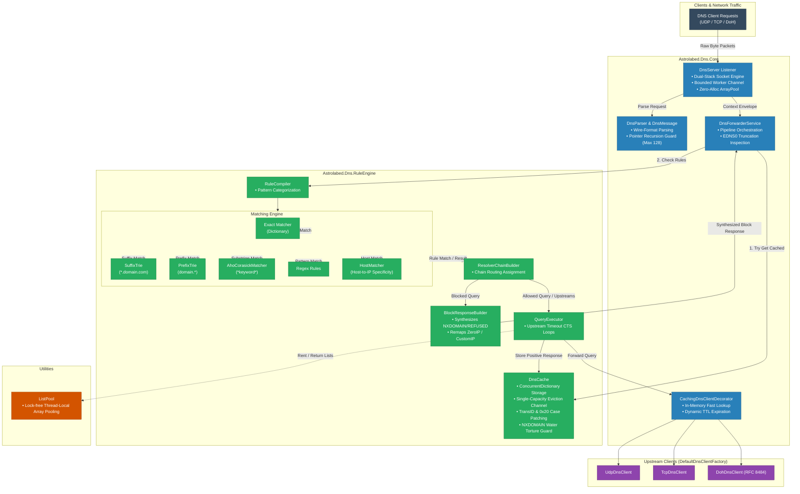

```mermaid
graph TD
    classDef client fill:#34495e,stroke:#2c3e50,color:#fff;
    classDef core fill:#2980b9,stroke:#1f618d,color:#fff;
    classDef rule fill:#27ae60,stroke:#1e8449,color:#fff;
    classDef upstream fill:#8e44ad,stroke:#6c3483,color:#fff;
    classDef util fill:#d35400,stroke:#a04000,color:#fff;

    subgraph Clients["Clients & Network Traffic"]
        DNS_Client["DNS Client Requests<br/>(UDP / TCP / DoH)"]:::client
    end

    subgraph CoreEngine["Astrolabed.Dns.Core"]
        Server["DnsServer Listener<br/>• Dual-Stack Socket Engine<br/>• Bounded Worker Channel<br/>• Zero-Alloc ArrayPool<byte>"]:::core
        Parser["DnsParser & DnsMessage<br/>• Wire-Format Parsing<br/>• Pointer Recursion Guard (Max 128)"]:::core
        Forwarder["DnsForwarderService<br/>• Pipeline Orchestration<br/>• EDNS0 Truncation Inspection"]:::core
        CachingDecorator["CachingDnsClientDecorator<br/>• In-Memory Fast Lookup<br/>• Dynamic TTL Expiration"]:::core
    end

    subgraph RuleEngine["Astrolabed.Dns.RuleEngine"]
        Cache["DnsCache<br/>• ConcurrentDictionary Storage<br/>• Single-Capacity Eviction Channel<br/>• TransID & 0x20 Case Patching<br/>• NXDOMAIN Water Torture Guard"]:::rule
        Compiler["RuleCompiler<br/>• Pattern Categorization"]:::rule
        
        subgraph Matchers["Matching Engine"]
            Exact["Exact Matcher<br/>(Dictionary<string, CompiledRule>)"]:::rule
            Suffix["SuffixTrie<br/>(*.domain.com)"]:::rule
            Prefix["PrefixTrie<br/>(domain.*)"]:::rule
            Aho["AhoCorasickMatcher<br/>(*keyword*)"]:::rule
            RegexM["Regex Rules"]:::rule
            HostM["HostMatcher<br/>(Host-to-IP Specificity)"]:::rule
        end

        ChainBuilder["ResolverChainBuilder<br/>• Chain Routing Assignment"]:::rule
        BlockBuilder["BlockResponseBuilder<br/>• Synthesizes NXDOMAIN/REFUSED<br/>• Remaps ZeroIP / CustomIP"]:::rule
        Executor["QueryExecutor<br/>• Upstream Timeout CTS Loops"]:::rule
    end

    subgraph Transport["Upstream Clients (DefaultDnsClientFactory)"]
        UdpClient["UdpDnsClient"]:::upstream
        TcpClient["TcpDnsClient"]:::upstream
        DohClient["DohDnsClient (RFC 8484)"]:::upstream
    end

    subgraph Utilities["Utilities"]
        ListPool["ListPool<T><br/>• Lock-free Thread-Local Array Pooling"]:::util
    end

    %% Ingestion Flow
    DNS_Client -->|Raw Byte Packets| Server
    Server -->|Parse Request| Parser
    Server -->|Context Envelope| Forwarder
    
    %% Pipeline & Cache Checking
    Forwarder -->|1. Try Get Cached| Cache
    Forwarder -->|2. Check Rules| Compiler
    
    %% Matching Process
    Compiler --> Matchers
    Matchers -->|Host Match| HostM
    Matchers -->|Exact Match| Exact
    Matchers -->|Suffix Match| Suffix
    Matchers -->|Prefix Match| Prefix
    Matchers -->|Substring Match| Aho
    Matchers -->|Pattern Match| RegexM

    %% Routing Decisions
    Matchers -->|Rule Match / Result| ChainBuilder
    
    %% Action Branching
    ChainBuilder -->|Blocked Query| BlockBuilder
    BlockBuilder -->|Synthesized Block Response| Forwarder
    
    ChainBuilder -->|Allowed Query / Upstreams| Executor
    Executor -->|Forward Query| CachingDecorator
    
    %% Upstream Protocols
    CachingDecorator --> UdpClient
    CachingDecorator --> TcpClient
    CachingDecorator --> DohClient

    %% Storage & Memory Optimizations
    Executor -->|Store Positive Response| Cache
    Executor .->|Rent / Return Lists| ListPool
```
