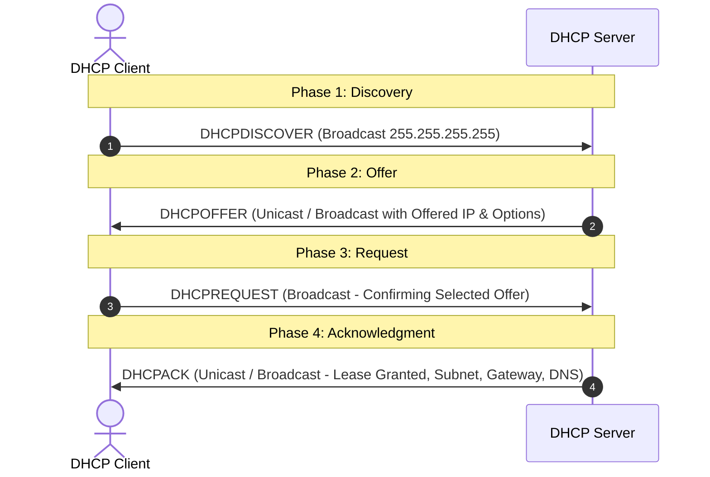

```mermaid
sequenceDiagram
    autonumber
    actor Client as DHCP Client
    participant Server as DHCP Server

    Note over Client, Server: Phase 1: Discovery
    Client->>Server: DHCPDISCOVER (Broadcast 255.255.255.255)
    
    Note over Client, Server: Phase 2: Offer
    Server->>Client: DHCPOFFER (Unicast / Broadcast with Offered IP & Options)
    
    Note over Client, Server: Phase 3: Request
    Client->>Server: DHCPREQUEST (Broadcast - Confirming Selected Offer)
    
    Note over Client, Server: Phase 4: Acknowledgment
    Server->>Client: DHCPACK (Unicast / Broadcast - Lease Granted, Subnet, Gateway, DNS)
```
