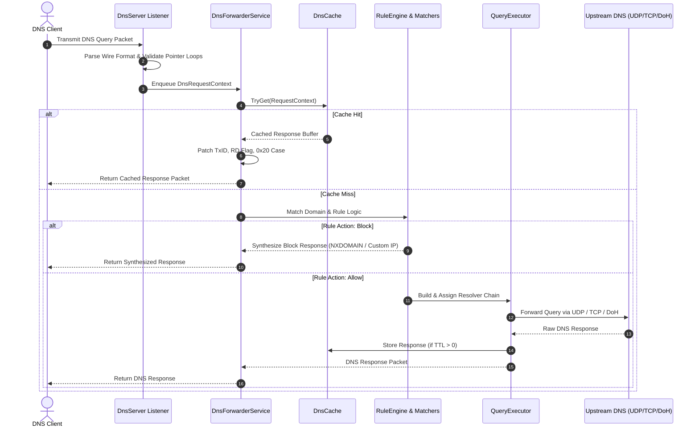

```mermaid
sequenceDiagram
    autonumber
    actor Client as DNS Client
    participant Listener as DnsServer Listener
    participant Forwarder as DnsForwarderService
    participant Cache as DnsCache
    participant Engine as RuleEngine & Matchers
    participant Executor as QueryExecutor
    participant Upstream as Upstream DNS (UDP/TCP/DoH)

    Client->>Listener: Transmit DNS Query Packet
    Listener->>Listener: Parse Wire Format & Validate Pointer Loops
    Listener->>Forwarder: Enqueue DnsRequestContext
    
    Forwarder->>Cache: TryGet(RequestContext)
    alt Cache Hit
        Cache-->>Forwarder: Cached Response Buffer
        Forwarder->>Forwarder: Patch TxID, RD Flag, 0x20 Case
        Forwarder-->>Client: Return Cached Response Packet
    else Cache Miss
        Forwarder->>Engine: Match Domain & Rule Logic
        alt Rule Action: Block
            Engine-->>Forwarder: Synthesize Block Response (NXDOMAIN / Custom IP)
            Forwarder-->>Client: Return Synthesized Response
        else Rule Action: Allow
            Engine->>Executor: Build & Assign Resolver Chain
            Executor->>Upstream: Forward Query via UDP / TCP / DoH
            Upstream-->>Executor: Raw DNS Response
            Executor->>Cache: Store Response (if TTL > 0)
            Executor-->>Forwarder: DNS Response Packet
            Forwarder-->>Client: Return DNS Response
        end
    end
```

