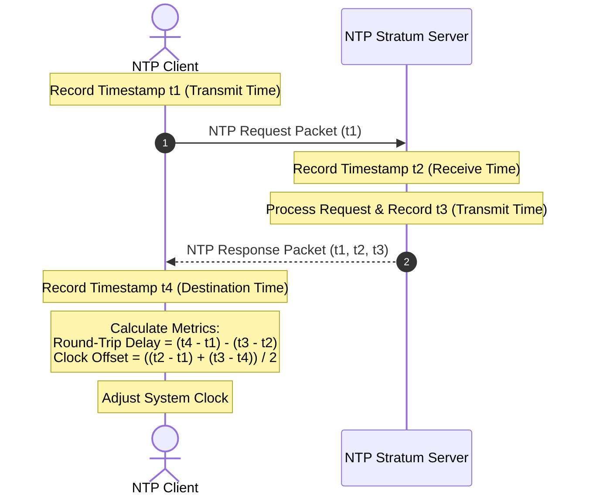

```mermaid
sequenceDiagram
    autonumber
    actor Client as NTP Client
    participant Server as NTP Stratum Server

    Note over Client: Record Timestamp t1 (Transmit Time)
    Client->>Server: NTP Request Packet (t1)
    
    Note over Server: Record Timestamp t2 (Receive Time)
    Note over Server: Process Request & Record t3 (Transmit Time)
    Server-->>Client: NTP Response Packet (t1, t2, t3)
    
    Note over Client: Record Timestamp t4 (Destination Time)
    
    Note over Client: Calculate Metrics:<br/>Round-Trip Delay = (t4 - t1) - (t3 - t2)<br/>Clock Offset = ((t2 - t1) + (t3 - t4)) / 2
    Note over Client: Adjust System Clock
```
