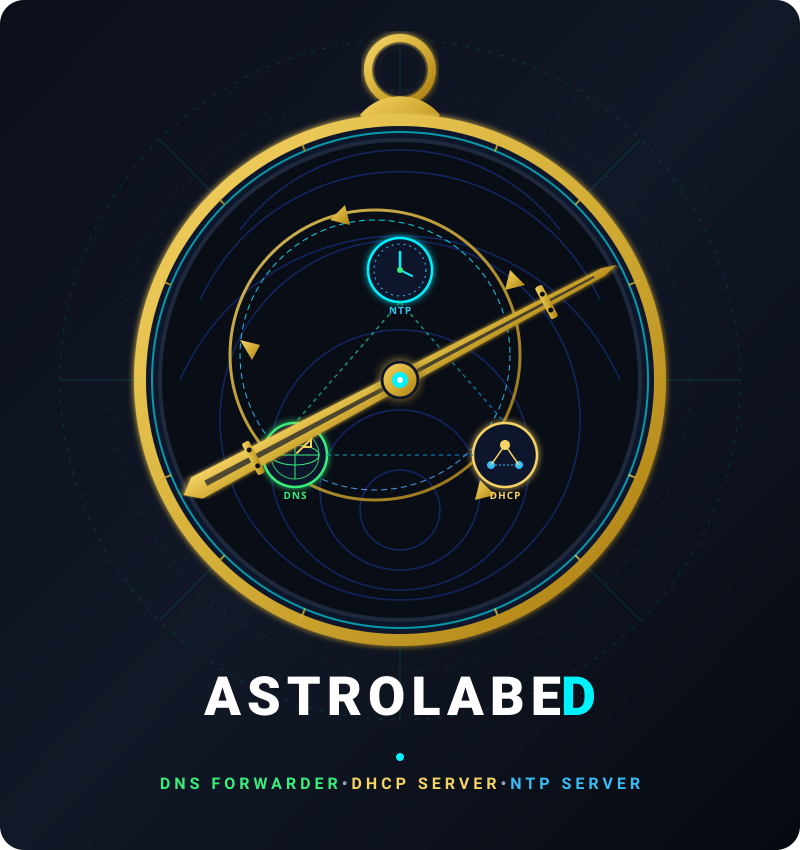

# Astrolabed

Astrolabed is a lightweight, high-performance DNS forwarder implemented in .NET. This documentation site contains usage guides, technical details, configuration examples, and architecture diagrams.

Documentation can be found here [https://guidcruncher.github.io/astrolabed/](https://guidcruncher.github.io/astrolabed/)
Source code can be found here [https://github.com/guidcruncher/astrolabed](https://github.com/guidcruncher/astrolabed)

License: MIT

---

[Guidcruncher on GitHub](https://github.com/guidcruncher)
