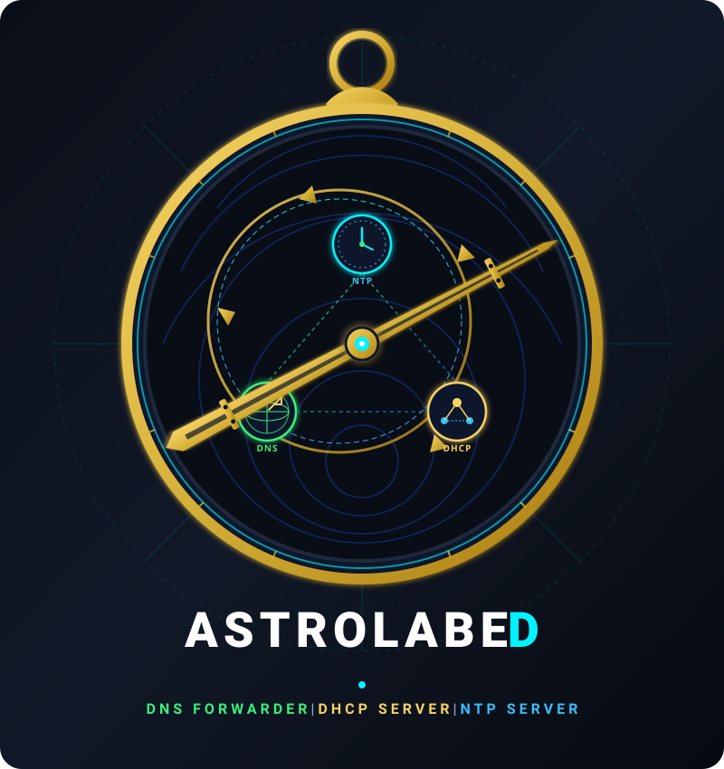

Astrolabed is a lightweight, high-performance DNS forwarder written in .NET. This docs folder contains both user-facing usage guides and developer-facing technical documentation.

Documentation can be found here [https://guidcruncher.github.io/astrolabed/](https://guidcruncher.github.io/astrolabed/)

---

License: MIT
